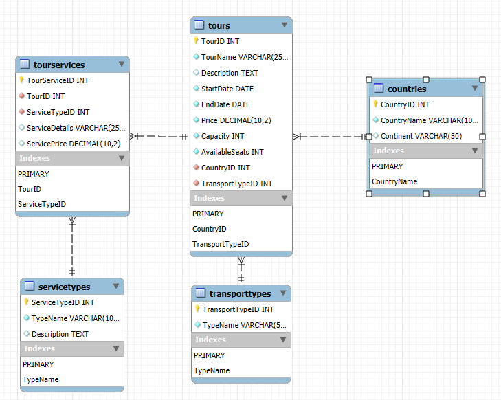

		-- phpMyAdmin SQL Dump
		-- version 5.2.1
		-- https://www.phpmyadmin.net/
		--
		-- Хост: localhost
		-- Время создания: Июн 01 2025 г., 06:51
		-- Версия сервера: 9.1.0
		-- Версия PHP: 8.3.14

		SET SQL_MODE = "NO_AUTO_VALUE_ON_ZERO";
		START TRANSACTION;
		SET time_zone = "+00:00";

		/*!40101 SET @OLD_CHARACTER_SET_CLIENT=@@CHARACTER_SET_CLIENT */;
		/*!40101 SET @OLD_CHARACTER_SET_RESULTS=@@CHARACTER_SET_RESULTS */;
		/*!40101 SET @OLD_COLLATION_CONNECTION=@@COLLATION_CONNECTION */;
		/*!40101 SET NAMES utf8mb4 */;

		--
		-- База данных: `tourism`
		--

		-- --------------------------------------------------------

		--
		-- Структура таблицы `countries`
		--

		CREATE TABLE `countries` (
		  `CountryID` int NOT NULL,
		  `CountryName` varchar(100) CHARACTER SET utf8mb4 COLLATE utf8mb4_ru_0900_ai_ci NOT NULL,
		  `Continent` varchar(50) CHARACTER SET utf8mb4 COLLATE utf8mb4_ru_0900_ai_ci DEFAULT NULL
		) ENGINE=InnoDB DEFAULT CHARSET=utf8mb4 COLLATE=utf8mb4_ru_0900_ai_ci;

		--
		-- Дамп данных таблицы `countries`
		--

		INSERT INTO `countries` (`CountryID`, `CountryName`, `Continent`) VALUES
		(1, 'Россия', 'Европа'),
		(2, 'Турция', 'Азия'),
		(3, 'Египет', 'Африка'),
		(4, 'Таиланд', 'Азия'),
		(5, 'Италия', 'Европа');

		-- --------------------------------------------------------

		--
		-- Структура таблицы `servicetypes`
		--

		CREATE TABLE `servicetypes` (
		  `ServiceTypeID` int NOT NULL,
		  `TypeName` varchar(100) CHARACTER SET utf8mb4 COLLATE utf8mb4_ru_0900_ai_ci NOT NULL,
		  `Description` text CHARACTER SET utf8mb4 COLLATE utf8mb4_ru_0900_ai_ci
		) ENGINE=InnoDB DEFAULT CHARSET=utf8mb4 COLLATE=utf8mb4_ru_0900_ai_ci;

		--
		-- Дамп данных таблицы `servicetypes`
		--

		INSERT INTO `servicetypes` (`ServiceTypeID`, `TypeName`, `Description`) VALUES
		(1, 'Проживание', 'Размещение в отеле'),
		(2, 'Питание', 'Завтрак, обед, ужин'),
		(3, 'Экскурсии', 'Обзорные и тематические экскурсии'),
		(4, 'Трансфер', 'Перевозка из аэропорта/вокзала в отель'),
		(5, 'Страховка', 'Медицинская страховка');

		-- --------------------------------------------------------

		--
		-- Структура таблицы `tours`
		--

		CREATE TABLE `tours` (
		  `TourID` int NOT NULL,
		  `TourName` varchar(255) CHARACTER SET utf8mb4 COLLATE utf8mb4_ru_0900_ai_ci NOT NULL,
		  `Description` text CHARACTER SET utf8mb4 COLLATE utf8mb4_ru_0900_ai_ci,
		  `StartDate` date NOT NULL,
		  `EndDate` date NOT NULL,
		  `Price` decimal(10,2) NOT NULL,
		  `Capacity` int NOT NULL,
		  `AvailableSeats` int NOT NULL,
		  `CountryID` int NOT NULL,
		  `TransportTypeID` int NOT NULL
		) ENGINE=InnoDB DEFAULT CHARSET=utf8mb4 COLLATE=utf8mb4_ru_0900_ai_ci;

		--
		-- Дамп данных таблицы `tours`
		--

		INSERT INTO `tours` (`TourID`, `TourName`, `Description`, `StartDate`, `EndDate`, `Price`, `Capacity`, `AvailableSeats`, `CountryID`, `TransportTypeID`) VALUES
		(1, 'Отдых в Турции', 'Пляжный отдых в Анталии', '2024-06-10', '2024-06-20', 50000.00, 30, 30, 2, 1),
		(2, 'Экскурсионный тур в Италию', 'Посещение Рима, Флоренции и Венеции', '2024-07-01', '2024-07-10', 80000.00, 20, 20, 5, 3),
		(3, 'Пляжный отдых в Египте', 'Отдых в Хургаде', '2024-08-01', '2024-08-10', 60000.00, 25, 25, 3, 1),
		(4, 'Тур в Тайланд', 'Отдых на Пхукете', '2024-09-15', '2024-09-25', 70000.00, 30, 30, 4, 1),
		(5, 'Путешествие по России', 'Золотое кольцо', '2024-06-01', '2024-06-08', 40000.00, 20, 20, 1, 3);

		-- --------------------------------------------------------

		--
		-- Структура таблицы `tourservices`
		--

		CREATE TABLE `tourservices` (
		  `TourServiceID` int NOT NULL,
		  `TourID` int NOT NULL,
		  `ServiceTypeID` int NOT NULL,
		  `ServiceDetails` varchar(255) CHARACTER SET utf8mb4 COLLATE utf8mb4_ru_0900_ai_ci DEFAULT NULL,
		  `ServicePrice` decimal(10,2) DEFAULT NULL
		) ENGINE=InnoDB DEFAULT CHARSET=utf8mb4 COLLATE=utf8mb4_ru_0900_ai_ci;

		--
		-- Дамп данных таблицы `tourservices`
		--

		INSERT INTO `tourservices` (`TourServiceID`, `TourID`, `ServiceTypeID`, `ServiceDetails`, `ServicePrice`) VALUES
		(1, 1, 1, 'Отель \"Sea Side\" 5*', 20000.00),
		(2, 1, 2, 'Завтрак, обед, ужин (шведский стол)', 10000.00),
		(3, 1, 3, 'Обзорная экскурсия по Анталии', 5000.00),
		(4, 2, 1, 'Отель \"Grand Hotel\" 4*', 30000.00),
		(5, 2, 2, 'Завтрак, ужин', 8000.00),
		(6, 2, 3, 'Экскурсия в Колизей', 10000.00),
		(7, 3, 1, 'Отель \"Red Sea\" 4*', 25000.00),
		(8, 3, 2, 'Завтрак, обед, ужин', 12000.00),
		(9, 4, 1, 'Отель \"Best Beach\" 4*', 30000.00),
		(10, 4, 2, 'Завтрак и ужин', 9000.00),
		(11, 5, 1, 'Гостиница \"Кольцо\" 3*', 15000.00),
		(12, 5, 2, 'Завтрак', 5000.00),
		(13, 5, 3, 'Обзорная экскурсия по городам Золотого Кольца', 8000.00);

		-- --------------------------------------------------------

		--
		-- Структура таблицы `transporttypes`
		--

		CREATE TABLE `transporttypes` (
		  `TransportTypeID` int NOT NULL,
		  `TypeName` varchar(50) CHARACTER SET utf8mb4 COLLATE utf8mb4_ru_0900_ai_ci NOT NULL
		) ENGINE=InnoDB DEFAULT CHARSET=utf8mb4 COLLATE=utf8mb4_ru_0900_ai_ci;

		--
		-- Дамп данных таблицы `transporttypes`
		--

		INSERT INTO `transporttypes` (`TransportTypeID`, `TypeName`) VALUES
		(3, 'Автобус'),
		(4, 'Круизный лайнер'),
		(2, 'Поезд'),
		(1, 'Самолет');

		--
		-- Индексы сохранённых таблиц
		--

		--
		-- Индексы таблицы `countries`
		--
		ALTER TABLE `countries`
		  ADD PRIMARY KEY (`CountryID`),
		  ADD UNIQUE KEY `CountryName` (`CountryName`);

		--
		-- Индексы таблицы `servicetypes`
		--
		ALTER TABLE `servicetypes`
		  ADD PRIMARY KEY (`ServiceTypeID`),
		  ADD UNIQUE KEY `TypeName` (`TypeName`);

		--
		-- Индексы таблицы `tours`
		--
		ALTER TABLE `tours`
		  ADD PRIMARY KEY (`TourID`),
		  ADD KEY `CountryID` (`CountryID`),
		  ADD KEY `TransportTypeID` (`TransportTypeID`);

		--
		-- Индексы таблицы `tourservices`
		--
		ALTER TABLE `tourservices`
		  ADD PRIMARY KEY (`TourServiceID`),
		  ADD UNIQUE KEY `TourID` (`TourID`,`ServiceTypeID`),
		  ADD KEY `ServiceTypeID` (`ServiceTypeID`);

		--
		-- Индексы таблицы `transporttypes`
		--
		ALTER TABLE `transporttypes`
		  ADD PRIMARY KEY (`TransportTypeID`),
		  ADD UNIQUE KEY `TypeName` (`TypeName`);

		--
		-- AUTO_INCREMENT для сохранённых таблиц
		--

		--
		-- AUTO_INCREMENT для таблицы `countries`
		--
		ALTER TABLE `countries`
		  MODIFY `CountryID` int NOT NULL AUTO_INCREMENT, AUTO_INCREMENT=6;

		--
		-- AUTO_INCREMENT для таблицы `servicetypes`
		--
		ALTER TABLE `servicetypes`
		  MODIFY `ServiceTypeID` int NOT NULL AUTO_INCREMENT, AUTO_INCREMENT=6;

		--
		-- AUTO_INCREMENT для таблицы `tours`
		--
		ALTER TABLE `tours`
		  MODIFY `TourID` int NOT NULL AUTO_INCREMENT, AUTO_INCREMENT=6;

		--
		-- AUTO_INCREMENT для таблицы `tourservices`
		--
		ALTER TABLE `tourservices`
		  MODIFY `TourServiceID` int NOT NULL AUTO_INCREMENT, AUTO_INCREMENT=14;

		--
		-- AUTO_INCREMENT для таблицы `transporttypes`
		--
		ALTER TABLE `transporttypes`
		  MODIFY `TransportTypeID` int NOT NULL AUTO_INCREMENT, AUTO_INCREMENT=5;

		--
		-- Ограничения внешнего ключа сохраненных таблиц
		--

		--
		-- Ограничения внешнего ключа таблицы `tours`
		--
		ALTER TABLE `tours`
		  ADD CONSTRAINT `tours_ibfk_1` FOREIGN KEY (`CountryID`) REFERENCES `countries` (`CountryID`),
		  ADD CONSTRAINT `tours_ibfk_2` FOREIGN KEY (`TransportTypeID`) REFERENCES `transporttypes` (`TransportTypeID`);

		--
		-- Ограничения внешнего ключа таблицы `tourservices`
		--
		ALTER TABLE `tourservices`
		  ADD CONSTRAINT `tourservices_ibfk_1` FOREIGN KEY (`TourID`) REFERENCES `tours` (`TourID`),
		  ADD CONSTRAINT `tourservices_ibfk_2` FOREIGN KEY (`ServiceTypeID`) REFERENCES `servicetypes` (`ServiceTypeID`);
		COMMIT;

		/*!40101 SET CHARACTER_SET_CLIENT=@OLD_CHARACTER_SET_CLIENT */;
		/*!40101 SET CHARACTER_SET_RESULTS=@OLD_CHARACTER_SET_RESULTS */;
		/*!40101 SET COLLATION_CONNECTION=@OLD_COLLATION_CONNECTION */;

**Проект базы данных «Туризм»** 

Предметная область: Туризм (перечень предоставляемых услуг, заказ туров и др.)

**Цель**: Создать базу данных для управления информацией о турах, услугах и заказах.

**Таблицы**:

1. **Справочники**:
   * **Countries (Страны)**
   * **TransportTypes (ТипыТранспорта)**
   * **ServiceTypes (ТипыУслуг)**

2. **Переменная информация**:
   * **Tours (Туры)**

3. **Связующая таблица**:
   * **TourServices (УслугиТура)**

**Структура таблиц и данные**
1. **Таблица-справочник**: `Countries` **(Страны)**

        CREATE TABLE Countries (
           CountryID INT PRIMARY KEY AUTO_INCREMENT,
           CountryName VARCHAR(100) NOT NULL UNIQUE,
           Continent VARCHAR(50)
        );
        
        INSERT INTO Countries (CountryName, Continent) VALUES
        ('Россия', 'Европа'),
        ('Турция', 'Азия'),
        ('Египет', 'Африка'),
        ('Таиланд', 'Азия'),
        ('Италия', 'Европа');

2. **Таблица-справочник**: `TransportTypes` **(Типы транспорта)**

        CREATE TABLE TransportTypes (
           TransportTypeID INT PRIMARY KEY AUTO_INCREMENT,
           TypeName VARCHAR(50) NOT NULL UNIQUE
           );
        
        INSERT INTO TransportTypes (TypeName) VALUES
        ('Самолет'),
        ('Поезд'),
        ('Автобус'),
        ('Круизный лайнер');

3. **Таблица-справочник**: `ServiceTypes` **(Типы услуг)**

        CREATE TABLE ServiceTypes (
           ServiceTypeID INT PRIMARY KEY AUTO_INCREMENT,
           TypeName VARCHAR(100) NOT NULL UNIQUE,
           Description TEXT
           );
        
        INSERT INTO ServiceTypes (TypeName, Description) VALUES
        ('Проживание', 'Размещение в отеле'),
        ('Питание', 'Завтрак, обед, ужин'),
        ('Экскурсии', 'Обзорные и тематические экскурсии'),
        ('Трансфер', 'Перевозка из аэропорта/вокзала в отель'),
        ('Страховка', 'Медицинская страховка');

4. **Таблица переменной информации**: `Tours` **(Туры)**

        CREATE TABLE Tours (
           TourID INT PRIMARY KEY AUTO_INCREMENT,
           TourName VARCHAR(255) NOT NULL,
           Description TEXT,
           StartDate DATE NOT NULL,
           EndDate DATE NOT NULL,
           Price DECIMAL(10, 2) NOT NULL,
           Capacity INT NOT NULL,
           AvailableSeats INT NOT NULL,
           CountryID INT NOT NULL,
           TransportTypeID INT NOT NULL,
           FOREIGN KEY (CountryID) REFERENCES Countries(CountryID),
           FOREIGN KEY (TransportTypeID) REFERENCES TransportTypes(TransportTypeID),
           CHECK (StartDate <= EndDate),
           CHECK (AvailableSeats <= Capacity)
        );
        
        INSERT INTO Tours (TourName, Description, StartDate, EndDate, Price, Capacity, AvailableSeats, CountryID, TransportTypeID) VALUES
        ('Отдых в Турции', 'Пляжный отдых в Анталии', '2024-06-10', '2024-06-20', 50000.00, 30, 30, 2, 1),
        ('Экскурсионный тур в Италию', 'Посещение Рима, Флоренции и Венеции', '2024-07-01', '2024-07-10', 80000.00, 20, 20, 5, 3),
        ('Пляжный отдых в Египте', 'Отдых в Хургаде', '2024-08-01', '2024-08-10', 60000.00, 25, 25, 3, 1),
        ('Тур в Тайланд', 'Отдых на Пхукете', '2024-09-15', '2024-09-25', 70000.00, 30, 30, 4, 1),
        ('Путешествие по России', 'Золотое кольцо', '2024-06-01', '2024-06-08', 40000, 20, 20, 1, 3);

6. **Таблица связующая**: `TourServices` **(Услуги тура)**

        CREATE TABLE TourServices (
           TourServiceID INT PRIMARY KEY AUTO_INCREMENT,
           TourID INT NOT NULL,
           ServiceTypeID INT NOT NULL,
           ServiceDetails VARCHAR(255),
           ServicePrice DECIMAL(10, 2),
           FOREIGN KEY (TourID) REFERENCES Tours(TourID),
           FOREIGN KEY (ServiceTypeID) REFERENCES ServiceTypes(ServiceTypeID),
           UNIQUE (TourID, ServiceTypeID)
        );
        
        INSERT INTO TourServices (TourID, ServiceTypeID, ServiceDetails, ServicePrice) VALUES
        (1, 1, 'Отель "Sea Side" 5*', 20000.00),
        (1, 2, 'Завтрак, обед, ужин (шведский стол)', 10000.00),
        (1, 3, 'Обзорная экскурсия по Анталии', 5000.00),
        (2, 1, 'Отель "Grand Hotel" 4*', 30000.00),
        (2, 2, 'Завтрак, ужин', 8000.00),
        (2, 3, 'Экскурсия в Колизей', 10000.00),
        (3, 1, 'Отель "Red Sea" 4*', 25000.00),
        (3, 2, 'Завтрак, обед, ужин', 12000.00),
        (4,1, 'Отель "Best Beach" 4*', 30000),
        (4,2, 'Завтрак и ужин', 9000),
        (5, 1, 'Гостиница "Кольцо" 3*', 15000),
        (5, 2, 'Завтрак', 5000),
        (5, 3, 'Обзорная экскурсия по городам Золотого Кольца', 8000);

**Описание данных**
* `Countries`: Содержит информацию о странах: Россия, Турция, Египет, Таиланд, Италия.

* `TransportTypes`: Содержит типы транспорта: Самолет, Поезд, Автобус, Круизный лайнер.

* `ServiceTypes`: Содержит типы услуг: Проживание, Питание, Экскурсии, Трансфер, Страховка.

* `Tours`: Содержит информацию о турах: название, описание, даты, цена, вместимость, доступные места, страна и тип транспорта.

* `TourServices`: Содержит информацию о том, какие услуги включены в каждый тур, с деталями и ценами.

Эта база данных предоставляет структуру и данные для управления информацией о туризме, включая туры, услуги и страны.
		

